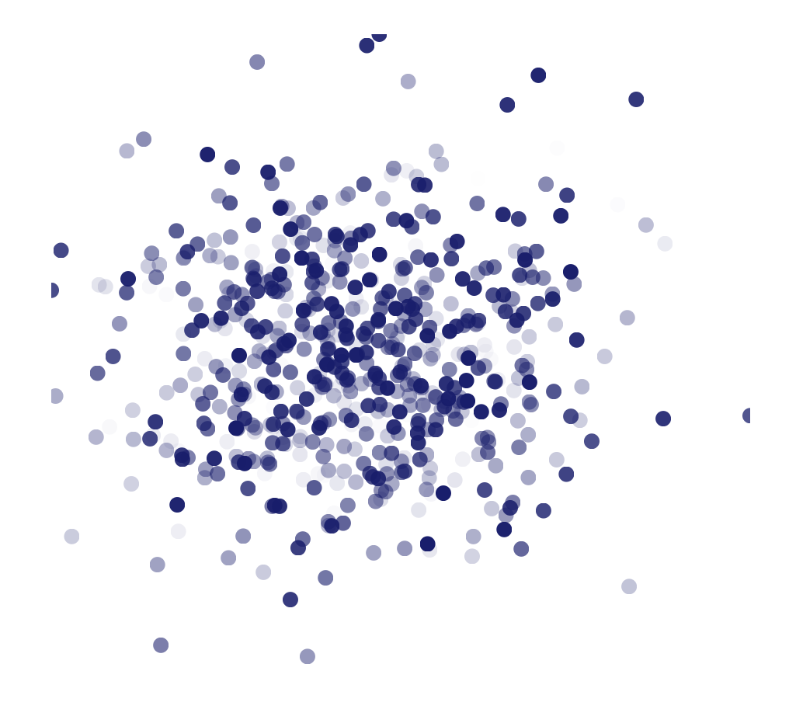

# vue-custom-plot

A Vue component for making custom scatter plots. This component does all of the math for you, so you make all the decisions about how your data renders.

## Installation

If you're using npm:

```
npm -i --save vue-custom-plot
```

Then include the component in your project like so:

```js
import { CustomPlot } from "vue-custom-plot"
```

## Usage

You can follow along with **this example on [codesandbox](https://codesandbox.io/s/xllnyyjww)**. We're going to make a _really_ basic scatter plot that looks like this:



All you need to get started with vue-custom-plot is the dimensions for your plot, and data in an array. Your data should be an array of objects, like this:

```js
var myPoints = [{"x": 13, "y": 401, "z": 0.6}, ... ]
```

We'll use this example going forward. Our data has `x`, `y`, and `z` values.

> **Note**: If you're making data visualizations, it's helpful to know about scalable vector graphics ([svg](https://developer.mozilla.org/en-US/docs/Web/SVG/Tutorial/Introduction)).

Suppose your component data looks like this:

```js
data() {
  return {
    // we'll populate our component with some data points
    dataPoints: myPoints,

    // we also need dimensions for svg
    width: 450,
    height: 450,
  }
}
```

You'll set up your template like so:

```html
<!-- set up our initial svg -->
<svg :width="width" :height="height">

<!-- we'll put our plot in here with the help of vue-custom-plot -->

</svg>
```

Now, vue-custom-plot needs three props to work: `xy-data`, `width`, and `height`. When we pass these props, vue-custom-plot will provide additional data back to us, namely the data we need to actually render our component.

We add the following to our template:

```html
<!-- set up our initial svg -->
<svg :width="width" :height="height">
  <!-- pass data into custom-plot -->
  <CustomPlot :xy-data="dataPoints" :width="width" :height="height">
    <!-- a scoped-slot gives us access to data we can use to render our plot with svg -->
    <g slot-scope="{ computedData }">
      <!-- we'll render our data in here -->
    </g>

  </CustomPlot>

</svg>
```

Vue-custom-plot has given us access to `computedData`, which is a array of object of the form:

```js
computedData = [{
  x // the original x
  y // the original y
  svgx // the x-coordinate for where the original x maps to on the svg
  svgy // the y-coordinate for where the original y maps to on the svg
  key // a simple key to use when rendering your data
  attrs: {
    z // the original z-value
    // any other data points that are not x or y go here
  }
} ... ]
```

We'll use `computedData` to visualize our data. We'll render circles whose opacity depends on the original z-value of our data (which is between 0 and 1). We complete our template:

```html
<!-- set up our initial svg -->
<svg :width="width" :height="height">
  <!-- pass data into custom-plot -->
  <CustomPlot :xy-data="dataPoints" :width="width" :height="height">
    <!-- a scoped-slot gives us access to data we can use to render our plot with svg -->
    <g slot-scope="{ computedData }">
      <!-- render a circle for each point in computedData -->
      <circle v-for="point in computedData"
        :key="point.key"
        :cx="point.svgx"
        :cy="point.svgy"
        :r="8"
        fill="midnightblue"
        :opacity="point.attrs.z">
      </circle>

    </g>

  </CustomPlot>

</svg>
```

## Component Documentation

### `<CustomPlot>`

#### Usage

```html
<CustomPlot
  :xy-data="myData"
  :width="width"
  :x-accessor="'xVariableName'"
  :y-accessor="d => doSomething(d.yVariable)"
  :height="height"
  :marginTop="margin"
  :marginLeft="margin">

  <g slot-scope="{computedData, xScale, yScale, svg}">

    <!-- render plot points here -->

  </g>

</CustomPlot>
```

#### Properties

| Property     | Type             | Default | Description                                                              |
| :----------- | :--------------- | :------ | :----------------------------------------------------------------------- |
| xyData       | Array            | _None_  | **Required**. An array of objects containing data to render              |
| xAccessor    | String, Function | `"x"`   | The name of the x-variable in `xyData`; it can be a string or a function |
| yAccessor    | String, Function | `"y"`   | The name of the y-variable in `xyData`; it can be a string or a function |
| width        | Number           | 500     | Width of the svg container                                               |
| height       | Number           | 500     | Height of the svg container                                              |
| marginLeft   | Number           | 0       | Left margin of the rendered plot                                         |
| marginTop    | Number           | 0       | Top margin of the rendered plot                                          |
| marginRight  | Number           | 0       | Right margin of the rendered plot                                        |
| marginBottom | Number           | 0       | Bottom margin of the rendered plot                                       |

#### Scoped-Slot

| Child Data   | Type     | Description                                                              |
| :----------- | :------- | :----------------------------------------------------------------------- |
| computedData | Array    | Array of objects containing original x/y data, and their svg coordinates |
| xScale       | Function | Scale taking x-values to their svg-coordinates                           |
| yScale       | Function | Scale taking y-values to their svg-coordinates                           |
| svg          | Object   | Object with dimension data, `{left, top, width, height}`                 |

### `<Axis>`

Coming Soon :blush:

## Philosophy

Below is some of my original thoughts on how Vue could be use to make custom plots.

> [See this thread for how I came up with this idea](https://twitter.com/pj_trainor/status/972930303374307328)
>
> Check out these demos:
>
> 1.  [First cut](https://codesandbox.io/s/n98jqj84jl)
> 2.  [Introduce chart-provider](https://codesandbox.io/s/l34zj5x82l)
> 3.  [Scoped Slots are nuts](https://codesandbox.io/s/2jq8q63ryj)
